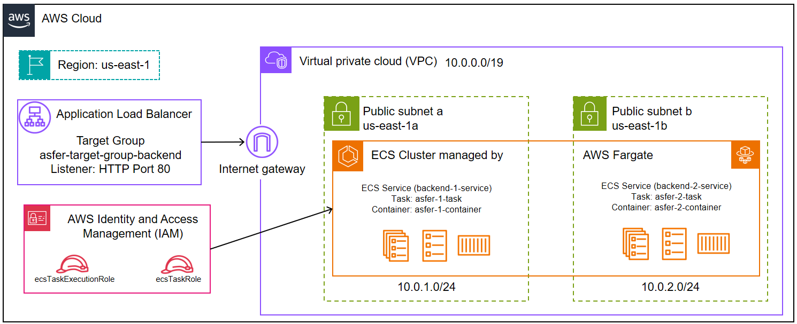
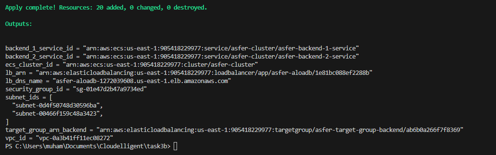
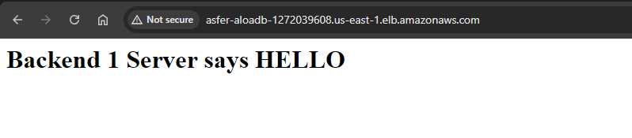
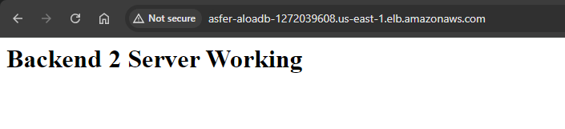

# AWS Infrastructure with ECS and Fargate

This project sets up an AWS infrastructure using Terraform. The infrastructure includes a VPC, subnets, security groups, IAM roles, an Application Load Balancer, ECS cluster, task definitions, and ECS services. The setup ensures high availability and load balancing for backend services.

## Prerequisites

- Terraform installed on your local machine
- AWS account with appropriate permissions
- AWS CLI installed and configured with your AWS credentials

## Project Structure

[](architecture.png)


## Infrastructure Components

- **VPC**: A virtual private cloud to host the network resources.
- **Subnets**: Two subnets in different availability zones.
- **Internet Gateway**: Enables internet access for the VPC.
- **Route Table**: Configures routing within the VPC.
- **Security Groups**: Controls inbound and outbound traffic.
- **IAM Roles**: Provides permissions for ECS tasks.
- **Application Load Balancer**: Distributes incoming traffic across multiple targets.
- **ECS Cluster**: Manages the container instances.
- **ECS Task Definitions**: Blueprints for running Docker containers.
- **ECS Services**: Ensures a specified number of tasks are running.


## Infrastructure Setup Details

### VPC and Networking

1. **Create VPC**:
   - A Virtual Private Cloud (VPC) is created with a CIDR block of `10.0.0.0/16`.
   - This VPC provides a secure and isolated network environment for our resources.

2. **Create Subnets**:
   - Two subnets are created within the VPC:
     - `asfer-subnetn-a` with CIDR block `10.0.1.0/24` in `us-east-1a` availability zone.
     - `asfer-subnetn-b` with CIDR block `10.0.2.0/24` in `us-east-1b` availability zone.

3. **Create Internet Gateway**:
   - An Internet Gateway (IGW) named `asfer-igwn` is created and attached to the VPC.
   - This allows resources within the VPC to access the internet.

4. **Create Route Table**:
   - A route table named `asfer-route-table` is created for the VPC.
   - A route is added to allow traffic from the subnets to the internet via the IGW.
   - The route table is associated with both subnets (`asfer-subnetn-a` and `asfer-subnetn-b`).

### Security Groups

5. **Create Security Group**:
   - A security group named `asfer-sgn` is created within the VPC.
   - Inbound rules allow HTTP traffic (port 80) from any IP.
   - Outbound rules allow all traffic to any IP.
   - This security group controls the traffic to and from our resources.

### IAM Roles

6. **Create IAM Roles**:
   - Two IAM roles are created:
     - `ecsTaskExecutionRoleTerraform` for ECS task execution with the `AmazonECSTaskExecutionRolePolicy` policy attached.
     - `ecsTaskRoleTerraform` for ECS tasks with the `AmazonEC2ContainerRegistryReadOnly` policy attached.
   - These roles provide necessary permissions for ECS tasks to execute and access required resources.

### Application Load Balancer

7. **Create Application Load Balancer**:
   - An Application Load Balancer (ALB) named `asfer-aloadb` is created.
   - The ALB is internet-facing and spans the two subnets created earlier.
   - The security group `asfer-sgn` is associated with the ALB to control traffic.
   - A target group named `asfer-target-group-backend` is created with `ip` as the target type and HTTP (port 80) as the protocol.
   - A listener is created on the ALB to forward HTTP (port 80) traffic to the target group.

### ECS Cluster and Task Definitions

8. **Create ECS Cluster**:
   - An ECS cluster named `asfer-cluster` is created to manage our container instances.

9. **Create ECS Task Definitions**:
   - Two ECS task definitions are created for our backend services:
     - `asfer-1-task` for Backend 1.
     - `asfer-2-task` for Backend 2.
   - Each task definition specifies the use of Fargate, the `awsvpc` network mode, and includes a container running the Nginx image.
   - The containers are configured to display different HTML messages indicating Backend 1 and Backend 2, respectively.

### ECS Services

10. **Create ECS Services**:
    - Two ECS services are created within the ECS cluster to ensure the defined number of task instances are running:
      - `asfer-backend-1-service` for Backend 1.
      - `asfer-backend-2-service` for Backend 2.
    - Both services use the respective task definitions and are configured to use the Fargate launch type.
    - The services are attached to the Application Load Balancer, which distributes traffic across the running tasks.

### Outputs

11. **Outputs**:
    - Various output values are provided for reference:
      - `vpc_id`: ID of the created VPC.
      - `subnet_ids`: IDs of the created subnets.
      - `security_group_id`: ID of the created security group.
      - `ecs_cluster_id`: ID of the created ECS cluster.
      - `backend_1_service_id`: ID of the created ECS service for Backend 1.
      - `backend_2_service_id`: ID of the created ECS service for Backend 2.
      - `lb_arn`: ARN of the created load balancer.
      - `lb_dns_name`: DNS name of the created load balancer.
      - `target_group_arn_backend`: ARN of the created target group for backend services.

---

This detailed setup ensures a robust and scalable infrastructure with high availability for your backend services using AWS ECS and Fargate.

## Cloning and Terraform Setup Details

### 1. Clone the Repository

Clone this repository to your local machine.

### 2. Initialize Terraform

Navigate to the project directory and run the following command to initialize the Terraform working directory:

```sh
terraform init
```

### 3. Review the Execution Plan

Generate and review the execution plan to understand the changes Terraform will make:

```sh
terraform plan
```

### 4. Apply the Configuration

Apply the Terraform configuration to provision the infrastructure. Confirm the action when prompted:

```sh
terraform apply
```

### 5. Access the Website

After Terraform completes the provisioning, it will output provide the output details of the resources created


[](results3.png)


Using the link provided by the Load Balancer created under DNS name:

```sh
http://<LoadBalancer-DNS-NAME(A-Record)>
```

The link leads us to the following results:

[](results1.png)

[](results2.png)

### 6. Clean Up Resources

To remove all resources created by Terraform, run:

```sh
terraform destroy
```

Confirm the destruction of resources when prompted.